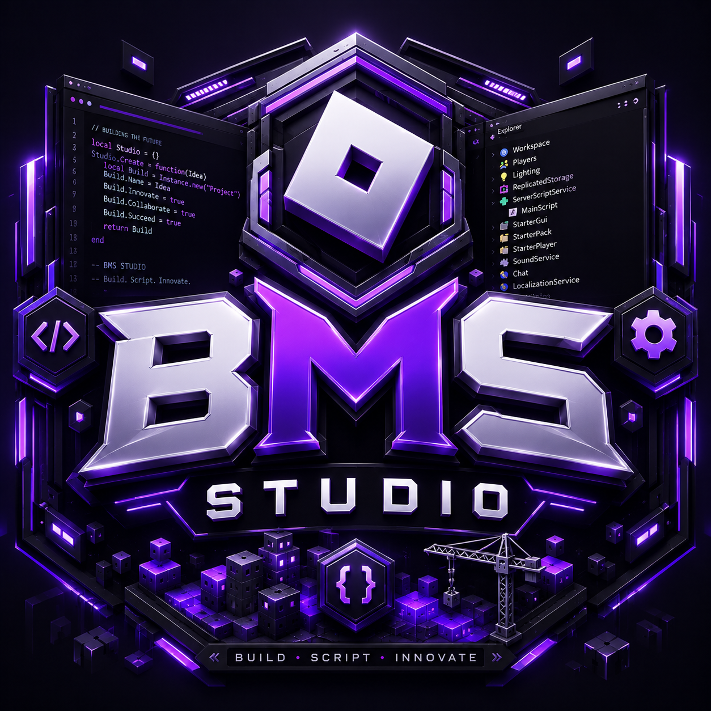

# BMS Studio AI

  

A modern AI platform built with React, Vite, and Tailwind CSS.
Fast, clean, and packed with powerful AI tools inside one elegant dashboard.

---

## ✨ Features

- 🤖 Multiple AI Chat Models
- 🎨 AI Image Generation
- 🖼 Image Analysis
- 📄 File Analysis
- ☁ Image Uploaders
- 📥 Media Downloaders
- 📰 News Explorer
- 🛠 Image Processing Tools
- ⚡ Fast & Responsive UI
- 🌙 Premium Dark Theme

---

## 🖥 Tech Stack

- React
- Vite
- Tailwind CSS
- JavaScript
- Axios

---

## 🎨 UI Style

- Premium Dark Theme
- Glassmorphism
- Responsive Layout
- Smooth Animations
- Modern Components
- Clean Dashboard

---

## 📜 License

MIT License

---

Made with ❤️ by **BMS Studio**

